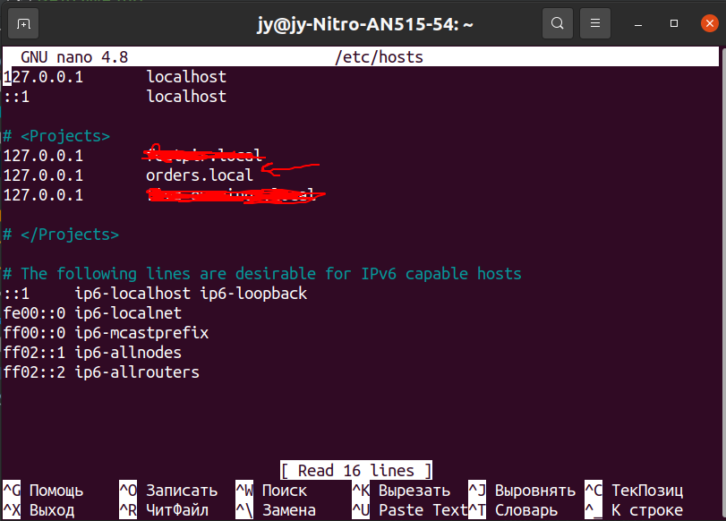

## Окружение
1. php 7.3-apache
2. postgres
3. docker

## Быстрый старт для локальной разработки
1. Добавьте сайт в etc/hosts на своем компьютере
   
2. Создайте в корне проекта файл .env и скопируйте туда содержимое из файла .env.example
3. Запустите сборку проекта командой \

   `docker-compose up --build`

4. После успешной сборки откройте вкладку для второго терминала и зайдите в контейнер с проектом \

   `docker exec -it app__web bash`

5. Выдайте права для apache

    `chown -R www-data:www-data /app/server/web`

6. Перейдите в папку server и примените миграции

    `cd server`
    `php yii migrate`

7. Теперь сайт для локальной разработки размещен по адресу: http://orders.local/

## Дополнительно
В сборнике городов находятся только из Ростовской области и при создании двух заявок в одном городе они будут наслаиваться друг на друга, поэтому визуально не покажет все заявки с одного города. Не силен во фронте, совсем.
В директории code_examples лежит три ярких примера по работе с прошлого проекта